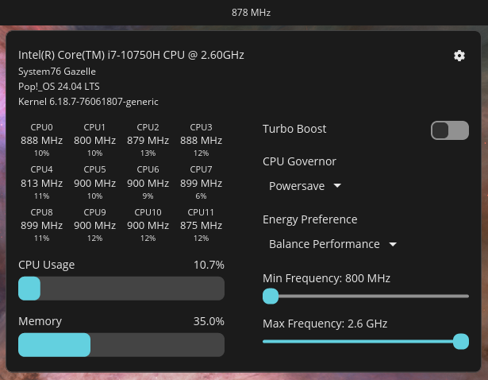

# cosmic-cpufreq

A COSMIC applet for inspecting and changing CPU frequency scaling settings on Linux.

Features:
- show current average CPU frequency in the panel
- toggle turbo boost
- change CPU governor
- change energy performance preference when available
- adjust minimum and maximum scaling frequency



## Requirements

- COSMIC desktop with applet support
- Rust toolchain
- `just`
- `pkexec` / polkit agent available in the desktop session
- kernel CPU frequency interfaces exposed under `/sys/devices/system/cpu`

## Build

```bash
cargo build --release
```

## Install

Install the user-local files:

```bash
just install
```

This places:
- the applet at `~/.local/bin/cosmic-ext-applet-cpufreq`
- the helper at `~/.local/bin/cosmic-cpufreqctl`
- the policy template at `~/.local/bin/dev.skylar.cosmic-ext-applet-cpufreq.policy`
- the desktop file at `~/.local/share/applications/dev.skylar.cosmic-ext-applet-cpufreq.desktop`

Then start or reload the applet from COSMIC. The first time you change a privileged setting, you should get a polkit prompt so the helper and policy can be installed system-wide.

## Updating after code changes

When you rebuild the applet, reinstall the local files:

```bash
cargo build --release
just install
```

If the applet is already running, reload it in COSMIC so the new binary is actually used. A running process can otherwise continue using an older deleted binary image.

If you need to force a clean helper/policy reinstall, remove the system copies:

```bash
pkexec /usr/bin/cosmic-cpufreqctl uninstall
```

Then change a setting in the applet again to trigger reinstallation of the current helper and policy.

## Frequency bounds

The applet uses kernel-exposed limits for writable frequency bounds:
- minimum comes from `cpuinfo_min_freq`
- maximum comes from `cpuinfo_max_freq`
- on Intel `intel_pstate`, turbo disabled uses `base_frequency` as the effective writable ceiling

This is intentional: slider limits should match frequencies the kernel will actually accept when writing `scaling_min_freq` and `scaling_max_freq`.

## Notes

- Governor and EPP controls only appear when the corresponding sysfs interfaces are available.
- Frequency sliders update on release, not continuously while dragging.
- The panel text shows the average current frequency across available cpufreq policies.

## Uninstall

Remove the local files:

```bash
just uninstall
```

Remove the system helper and polkit policy:

```bash
pkexec /usr/bin/cosmic-cpufreqctl uninstall
```
